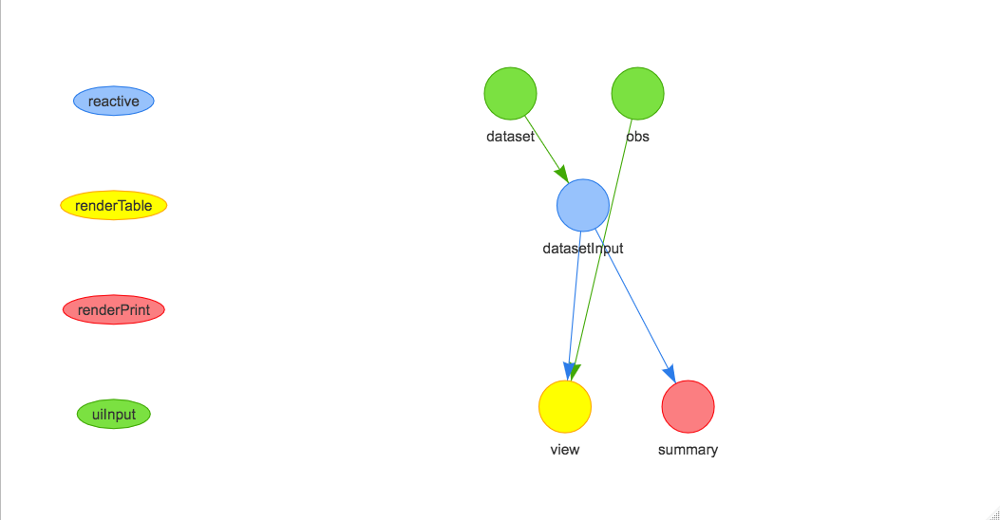

---
output:
  md_document:
    variant: markdown_github
always_allow_html: yes
---

<!-- README.md is generated from README.Rmd. Please edit that file -->

```{r, echo = FALSE}
knitr::opts_chunk$set(
  collapse = TRUE,
  comment = "#>",
  fig.path = "README-"
)
```

# shinycovr

The goal of shinycovr is to create coverage statistics for shiny apps testing.

## Example

This is a basic example which shows you how to solve a common problem:

```{r example}
x <- ShinyTester::ShinyHierarchy(system.file('shinyexample',package='shinycovr'))
```



```{r}
x$x$edges
x$x$nodes
```

### Calculating Possible reactive paths 

Using the ShinyTester output object

```{r}
shinycovr::shiny_path(x)
```

Using an igraph object

```{r}
x2 <- igraph::graph_from_data_frame(x$x$edges,directed = TRUE)

plot(x2)

shinycovr::shiny_path(x2)
```

Using an adjency matrix object

```{r}
x3 <- igraph::as_adj(x2)

x3

shinycovr::shiny_path(x3)
```