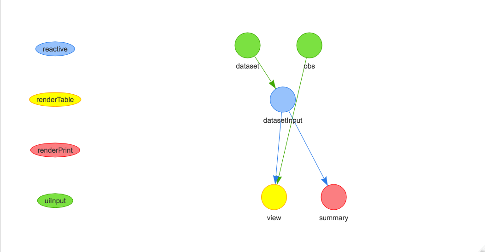
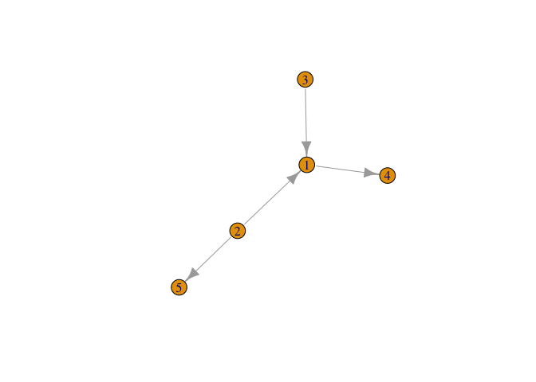

<!-- README.md is generated from README.Rmd. Please edit that file -->
shinycovr
=========

The goal of shinycovr is to create coverage statistics for shiny apps
testing.

Example
-------

This is a basic example which shows you how to solve a common problem:

``` r
x <- ShinyTester::ShinyHierarchy(system.file('shinyexample',package='shinycovr'))
```



``` r
x$x$edges
#>   to from
#> 1  1    4
#> 2  2    5
#> 3  3    1
#> 4  2    1
x$x$nodes
#>        Thingie       group id        label    level
#> 1 datasetInput    reactive  1 datasetInput 2.031717
#> 2         view renderTable  2         view 3.000000
#> 3      summary renderPrint  3      summary 3.000000
#> 5      dataset     uiInput  4      dataset 1.000000
#> 6          obs     uiInput  5          obs 1.000000
```

### Calculating Possible reactive paths

Using the ShinyTester output object

``` r
shinycovr::shiny_path(x)
#> [1] "obs=>view"                      "dataset=>datasetInput=>view"   
#> [3] "dataset=>datasetInput=>summary"
```

Using an igraph object

``` r
x2 <- igraph::graph_from_data_frame(x$x$edges,directed = TRUE)

plot(x2)
```



``` r

shinycovr::shiny_path(x2)
#> [1] "2=>5"    "2=>1=>4" "3=>1=>4"
```

Using an adjency matrix object

``` r
x3 <- igraph::as_adj(x2)

x3
#> 5 x 5 sparse Matrix of class "dgCMatrix"
#>   1 2 3 4 5
#> 1 . . . 1 .
#> 2 1 . . . 1
#> 3 1 . . . .
#> 4 . . . . .
#> 5 . . . . .

shinycovr::shiny_path(x3)
#> [1] "2=>5"    "2=>1=>4" "3=>1=>4"
```
